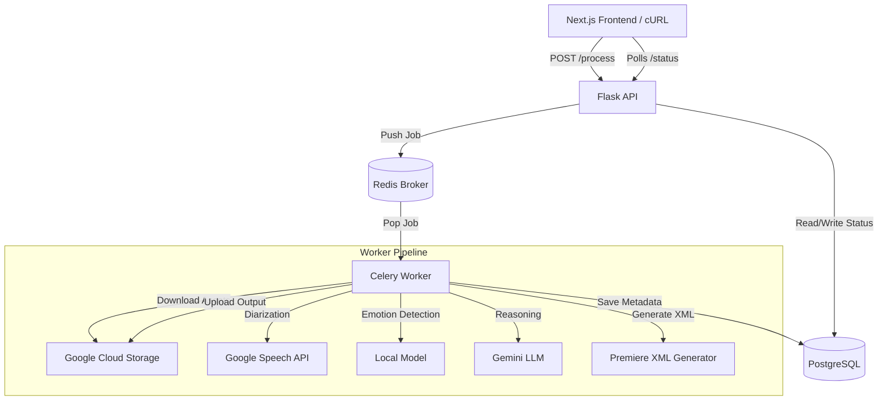

# VidPal Architecture & Implementation Guide

**Version:** 2.1 (Dockerized Microservices Update)
**Date:** November 2025
**Status:** MVP / Pre-Alpha

## 1\. Project Overview

VidPal is an AI-powered "Backend-for-Frontend" (BFF) system designed to automate the initial rough cut of multi-camera video podcasts. It ingests raw video/audio footage, analyzes content using a hybrid of Cloud AI and Local Computer Vision models, and generates an industry-standard Adobe Premiere Pro XML (`.xml`) sequence.

The system is designed to run as a set of containerized microservices, capable of deployment on a single high-performance VM (GCP) or local development environments.

## 2\. Tech Stack

### Infrastructure & Orchestration

  * **Runtime:** Python 3.10 (Slim Debian-based images)
  * **Containerization:** Docker & Docker Compose
  * **Task Queue:** Celery 5.3+
  * **Message Broker:** Redis 7 (Alpine)
  * **Database:** PostgreSQL 16 + `pgvector` (for future RAG/Semantic Search)

### Backend Frameworks

  * **API Server:** Flask 3.0 + Gunicorn
  * **Worker:** Celery Worker (Concurrency: 1 per heavy-lift container)

### AI & Signal Processing

  * **Audio Diarization:** Google Cloud Speech-to-Text API (Model: `latest_long`)
  * **Computer Vision (Emotion):** MediaPipe Face Landmarker (Running locally on CPU/GPU)
  * **LLM / Reasoning:** Google Gemini 1.5 Flash (via Vertex AI or AI Studio)
  * **Video I/O:** `ffmpeg` (installed at OS level in container)

## 3\. System Architecture

The system follows an **Asynchronous Task Queue** pattern to handle long-running video processing jobs.



### Services Description

1.  **`api` (Flask):**
      * Entry point. Accepts JSON payloads with GCS URIs.
      * Validates input.
      * Creates initial DB record.
      * Dispatches async task to Celery.
      * Provides status endpoints for client polling.
2.  **`worker` (Celery):**
      * The "Heavy Lifter."
      * Contains the core logic (`VidPalAIPipeline`).
      * Mounts local volumes for temp processing.
      * Executes sequential phases (Download -\> Analyze -\> Edit -\> Upload).
3.  **`redis`:**
      * Message broker for Celery.
      * Stores ephemeral task state.
4.  **`postgres`:**
      * Persistent source of truth.
      * Stores Episode state, Speaker Segments, and Reaction Events.

## 4\. Data Flow Lifecycle

### Step 1: Ingestion

  * **Input:** Client uploads files to GCS bucket independently.
  * **Trigger:** Client sends `POST /process` with `audio_url` and `video_urls` (GCS URIs).
  * **Action:** API generates `episode_id`, sets status to `queued`, and returns `task_id` immediately.

### Step 2: Processing (The Pipeline)

The `VidPalAIPipeline.process_episode()` method executes the following phases:

1.  **Asset Acquisition:**
      * Worker resolves URIs.
      * If URI is `gs://`, downloads to `/tmp/vidpal_processing/<episode_id>`.
      * If URI is local path (dev mode), copies to temp dir.
2.  **Audio Analysis (Diarization):**
      * **Check 1:** Checks DB for existing segments (Idempotency).
      * **Check 2:** Checks File Cache (`.cache/`) for previous API results.
      * **Action:** Uploads audio to GCS -\> Triggers Google Speech LongRunningRecognize -\> Returns Transcripts & Speaker Timestamps.
3.  **Visual Analysis (Emotion):**
      * Runs MediaPipe Face Landmarker on video files.
      * Detects "Reaction Events" (Smiles, Laughter) based on blendshape scores.
      * Stores events in DB.
4.  **Identity Mapping:**
      * Uses Gemini to correlate "Speaker A" (Audio) with "Camera 1" (Visual).
5.  **Edit Decision List (EDL) Generation:**
      * Applies rules: *Who is speaking? Are they on camera? Is someone else laughing?*
      * Generates a list of Cuts (In-point, Out-point, Source File).
6.  **XML Generation:**
      * Converts EDL to Adobe Premiere XMEML v4 format.
      * Calculates precise frame integers based on `config.FRAME_RATE`.
7.  **Finalization:**
      * Uploads `.xml` to GCS.
      * Updates DB `metadata` with the final download link.
      * Cleans up `/tmp` directory.

## 5\. Directory Structure & Key Files

```text
VidPal-deployment/
├── api/                    # Application Entry Points
│   ├── app.py              # Flask Server
│   └── worker.py           # Celery Worker Entry
├── config.py               # Central Config (Pydantic) - Handles Path resolution
├── pipeline.py             # Main Orchestrator Class
├── docker-compose.yml      # Service Definition
├── Dockerfile              # Unified image for API and Worker
├── requirements.txt        # Python Dependencies
│
├── db/                     # Database Layer
│   ├── connection.py       # Connection Pooling
│   └── models.py           # SQL Queries & Repository Pattern
│
├── processing/             # AI Logic Modules
│   ├── speaker_identification.py  # Google Speech Wrapper
│   ├── emotion.py                 # MediaPipe Wrapper
│   └── speaker_camera_mapping.py  # Gemini Logic
│
├── edl/                    # Editing Logic
│   └── rules.py            # Cut generation algorithm
│
├── fcpxml/                 # Output Generation
│   └── premiere_xml_generator.py  # XMEML Builder
│
├── models/                 # Binary Models
│   └── face_landmarker.task  # MediaPipe Model File
│
└── utils/
    └── caching.py          # JSON File Cache utility
```

## 6\. Configuration & Environment

Configuration is managed via `pydantic-settings` in `config.py`. It prioritizes Environment Variables \> `.env` file \> Defaults.

**Critical Environment Variables (`.env`):**

```bash
GOOGLE_APPLICATION_CREDENTIALS=/app/gcp_key.json
GOOGLE_CLOUD_PROJECT=your-project-id
GCS_BUCKET_NAME=your-bucket-name
POSTGRES_HOST=postgres
CELERY_BROKER_URL=redis://redis:6379/0
```

**Key Configuration Logic:**

  * **`BASE_DIR`**: Dynamically resolves to the project root (`/app` in Docker, `./` locally).
  * **`FACE_LANDMARKER_PATH`**: Defined as a string relative to `BASE_DIR`. Converted to `Path` at runtime to prevent Pydantic validation crashes during startup.
  * **`CACHE_DIR`**: Set to `.cache`. Mounted via Docker volume to persist API responses between restarts.

## 7\. Database Schema (Simplified)

  * **`episodes`**: `episode_id` (PK), `status`, `metadata` (JSONB - stores output links).
  * **`video_files`**: Maps `episode_id` + `camera_id` to file paths.
  * **`speaker_segments`**: Stores `start_time`, `end_time`, `speaker_label`, `text`.
  * **`reaction_events`**: Stores `timestamp`, `score`, `event_type` (e.g., "smile").

## 8\. Development Workflow

### Running Locally (Docker)

1.  Ensure `gcp_key.json` and `models/face_landmarker.task` are present.
2.  Populate `input/` with test media (optional, if using local mounts).
3.  Run:
    ```bash
    docker compose up -d --build
    ```

### Testing

Use `curl` to trigger the pipeline.

  * **Local File Mode:** Use paths like `/app/data/test/audio.mp3`.
  * **Cloud Mode:** Use paths like `gs://bucket/file.mp3`.

<!-- end list -->

```bash
curl -X POST http://localhost:5000/process -H "Content-Type: application/json" -d '{
    "episode_id": "test-01",
    "audio_url": "/app/data/test/audio.mp3",
    "video_urls": {"cam1": "/app/data/test/cam1.mp4"}
}'
```

## 9\. Current Constraints & "Gotchas"

1.  **MediaPipe in Docker:** Requires `libgl1` and `libglib2.0-0` installed via `apt-get` (handled in Dockerfile).
2.  **GCS Permissions:** The Service Account requires `Storage Admin` (or `buckets.get` + `objects.create`) and **Service Usage Consumer** role to bill against the project.
3.  **Path Handling:** All paths in code should use `settings.BASE_DIR` to ensure compatibility between Host OS and Docker Container.
4.  **Caching:** Both DB and File Cache are used. DB stores final segments; File Cache stores raw API responses. The system checks DB first, then File Cache, then API.
